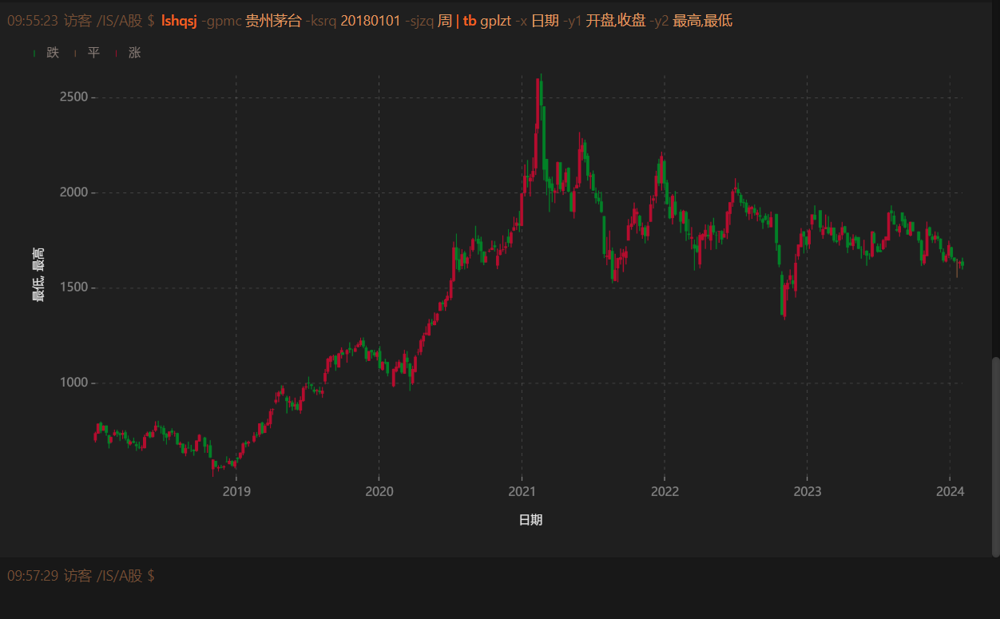

	

<h1 align="center" style="margin: 30px 0 30px; font-weight: bold;">iStock Shell v0.1</h1>
<h4 align="center">一个金融数据查询命令终端</h4>
<h4 align="center">它简单、高效、灵活，并很容易定制自己的金融数据查询工具。</h4>

---

### 项目介绍

`iStock Shell`是一款用于研究和学习的金融数据查询工具，设计理念围绕着`简单性、高效率、灵活性以及可定制性展开`，技术上尽可能不依赖后端服务。它为用户提供了一个统一的平台，通过简单的命令输入，即可查询并展示来自不同数据源的金融信息。
项目演示地址：[https://istock.red/shell](https://istock.red/shell)

#### 特性

- `简单`：通过直观的命令输入，轻松查询金融数据，无需任何复杂操作；提供全面且易于理解的命令文档，确保您能快速上手。
- `高效`：强大的自动补全功能，令命令输入流畅自如；支持快速翻阅输入历史，重复查询变得更加迅速。
- `灵活`：提供丰富的命令参数选择，满足您对数据展示的多样需求；支持使用管道命令，为您的数据查询提供无限可能。

#### 技术栈

`svelte + typescript + vite`

### 内置功能

- [全局命令](https://istock.red/use/command/)
- [A股命令](https://istock.red/use/command/)

### 相关文档

- [文档首页](https://istock.red/)
- [快速开始](https://istock.red/use/quick-start/easy-to-use.html)
- [开发指南](https://istock.red/develop/command/knowledge.html)

### 迭代计划

**03月04日-03月10日：**

|     任务项目     |              描述              | 该迭代是否上线 |
| :--------------: | :----------------------------: | :------------: |
| 金融网站导航命令 | 用命令获取对应分类金融网站列表 |       是       |
|   添加命令别名   |  命令输入返回后可添加命令别名  |       是       |

**03月11日-03月17日预计任务项：**

暂无安排

### 参与贡献

1.  Fork 本仓库
2.  新建 Feat_xxx 分支
3.  提交代码
4.  新建 Pull Request