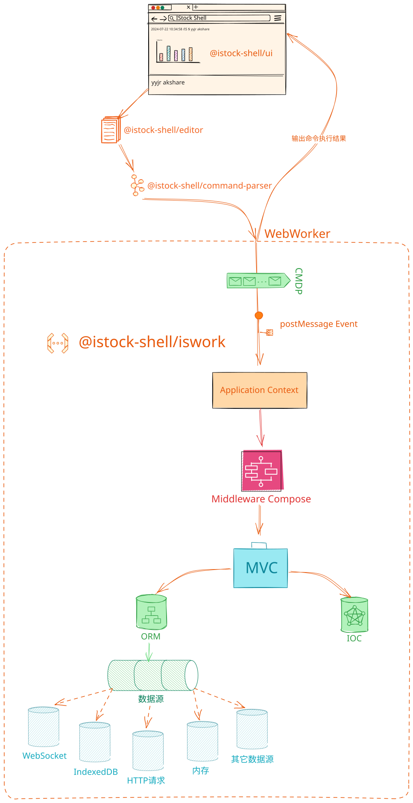

# 核心原理与架构

iStock Shell 是一款基于 Web 技术的现代化金融分析终端，它巧妙地融合了命令行交互（CLI）的高效性与图形用户界面（GUI）的直观性。本章将深入剖析其底层架构设计、核心组件交互以及数据流转机制，帮助开发者全面理解系统的运行原理。

## 系统架构概览

iStock Shell 采用分层架构设计，严格遵循 **关注点分离 (Separation of Concerns)** 原则。核心业务逻辑运行在独立的 Web Worker 线程中，实现了计算与渲染的物理隔离，确保了在处理大规模金融数据时界面的极致流畅。

### 1. 展现层 (Shell UI)

- **技术栈**: Svelte, TailwindCSS, DaisyUI
- **职责**:
  - **终端仿真**: 提供接近原生 Shell 的输入体验，支持自动补全、历史记录、语法高亮。
  - **可视化渲染**: 根据业务层返回的数据类型，动态挂载表格、K线图、分时图等可视化组件。
  - **交互反馈**: 实时响应用户操作，通过 MessageChannel 与 Worker 进行双向通信。

### 2. 解析层 (Command Engine)

- **核心库**: `@istock-shell/command-parser`
- **职责**: 将命令转换为机器可理解的结构化数据（AST）。
- **特性**:
  - **完整编译管线**: 包含词法分析 (Lexer)、语法分析 (Parser)。
  - **高级语法支持**: 支持管道操作 (`|`, `&`)、逻辑运算 (`&&`, `||`)、命令分组 `()` 以及特殊前缀指令（如 `ai:` 调用大模型）。

### 3. 业务逻辑层 (Worker)

这是系统的"大脑"，运行在 Web Worker 线程中，基于自研的 **`@istock-shell/iswork`** 框架构建。该框架深度借鉴了 NestJS 的设计理念，为前端业务逻辑提供了企业级的架构支持。

- **核心特性**:
  - **模块化 (Modularity)**: 通过 `Domain` (类似 Module) 组织代码，实现业务解耦。
  - **依赖注入 (DI)**: 内置 IoC 容器，管理对象生命周期与依赖关系，提升代码可测试性。
  - **元数据编程**: 大量使用装饰器 (`@Controller`, `@Injectable`, `@Domain`) 简化配置。
  - **CMDP 协议**: 定义了一套标准的消息通信协议，类似于 HTTP，用于 UI 与 Worker 间的通讯。

### 4. 数据层 (Data Infrastructure)

- **数据源**: 集成 AkShare 等开源财经数据接口，支持 HTTP等。
- **本地存储**: 基于 IndexedDB 构建了轻量级 ORM，支持本地数据缓存与离线查询。
- **内存缓存**: 运行时的高速数据缓存机制。

---

## 核心运行机制

### 1. 命令解析与 AST 构建

当用户在终端输入命令（例如 `stock sh600000 | kline -d`）时，解析器会经历以下过程：

1. **词法分析**: 将字符串分解为 Token 流。
2. **语法分析**: 构建抽象语法树 (AST)。
   ```json
   {
     "type": "PIPE",
     "left": { "command": "stock", "args": ["sh600000"] },
     "right": { "command": "kline", "options": { "d": true } }
   }
   ```

### 2. 消息路由与分发 (CMDP Protocol)

UI 层将解析后的指令封装为标准的 **CMDP (Command Message Data Protocol)** 消息发送给 Worker。
`isWork` 框架接收消息后，通过 **路由表** 匹配对应的控制器：

- **Domain**: 确定业务域（如 StockDomain）
- **Controller**: 确定控制器（如 QuoteController）
- **Method**: 确定执行方法（如 getKline）

### 3. 业务处理与依赖注入

控制器方法被调用时，IoC 容器会自动注入所需的 `Service`。

```typescript
@Controller('quote')
export class QuoteController {
  constructor(private stockService: StockService) {} // 自动注入

  @Cmd('kline')
  async getKline(@Payload() symbol: string) {
    // 业务逻辑处理：查询数据库或请求 API
    return await this.stockService.fetchKline(symbol);
  }
}
```

### 4. 结果响应与渲染

业务层处理完成后，结果（可能是 JSON 数据、图表配置或纯文本）通过 Worker 消息返回给 UI。UI 层根据返回的数据类型智能选择渲染器：

- **Text**: 直接输出文本。
- **JSON**: 格式化展示或表格展示。
- **Chart Config**: 动态加载 ECharts/G2 等图表库进行渲染。

## 执行流程图

下图完整展示了从用户输入到结果呈现的全链路流程：

<p></p>
