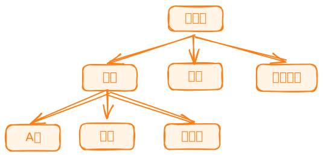

# 应用域

`iStock Shell`通过引入应用域概念，将业务相关代码划分到界定的范围，鼓励将业务相关代码集中管理，确保代码既井然有序又界限分明。

## 什么是应用域

应用域是`iStock Shell`特有的概念，我们认为每个特定的业务应看成一个应用，用户可以使用应用域内的命令完成该业务相关的操作。除了根应用域外，每个应用域都应该有自己的父应用域。

## 根应用域

根应用域是构建应用域的起点，在`iStock Shell`中扮演着至关重要的角色，它是所有应用域的基石和出发点。

## 应用域示例图

<p></p>

## 定义及使用应用域

我们将以定义及使用`A股`应用域为例，来具体说明应用域的定义和使用。

### 定义应用域

创建`A股`应用域文件`ag.domain.ts`，路径为`src/worker/domains/ag/ag.domain.ts`，然后导入应用域`Domain`装饰器，我们通过`Domain`装饰器将类定义为应用域，示例代码：

```typescript
import { Domain } from '@istock/iswork';

@Domain({
  name: 'ag',
  viewName: 'A股',
  providers: [],
  controllers: [],
  middlewares: [],
})
export class AgDomain {}
```

`Domain`装饰器接受如下参数：

```typescript
export type TDomainMetadata = {
  name: string; // 为应用域定义一个唯一的名称
  viewName: string; // 应用域的显示名称
  imports?: TMetadataImport[]; // 需要导入的子应用域
  controllers?: TController[]; // 应用域所属的控制器
  providers?: TProviderMeta[]; // 提供者，供控制器依赖注入使用，提供者一般是服务类
  exports?: TMetadataExport[]; // 暴露到外部应用域所使用的控制器或提供者
  middlewares?: TMiddleware[]; // 应用域所需要使用的中间件
};
```

### 使用应用域

将`A股`应用域导入到`根`应用域，代码路径`src/worker/domains/root.domain.ts`，示例代码：

```typescript
import { Global, Domain } from '@istock/iswork';
// ...
import { AgDomain } from './ag/ag.domain'; // [!code ++]
// ...

@Global()
@Domain({
  name: 'root',
  viewName: '根',
  imports: [
    //...
    AgDomain, // [!code ++]
    // ...
  ],
  providers: [],
})
export class RootDomain {}
```
