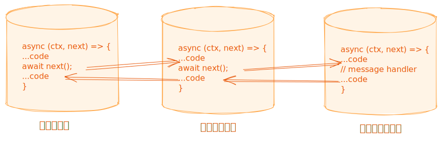

# 中间件

`中间件`是在消息处理程序之前调用的`函数`，它采用`洋葱模型`，即消息请求会依次通过所有中间件，而在消息响应时则会逆序通过中间件。中间件函数可以获取ApplicationContext对象，以便处理额外的业务逻辑。

::: info 消息处理程序
消息处理程序本质上也是一个中间件函数，不过它始终在所有中间件的最后面执行，是一个特殊的中间件。
:::

## 中间件执行流程

<p></p>

## 全局中间件

当发起任何消息请求时，`全局中间件`都会在消息处理程序执行前执行。

## 应用域中间件

当发起应用域内的消息请求时，`应用域中间件`会在改应用域消息处理程序执行前执行。如果存在`全局中间件`，`全局中间件`比`应用域中间件`先执行。

## 中间件开发与使用

### 全局中间件

下面将以开发全局日志中间件功能为例，阐述如何开发和使用全局中间件。
在目录`src/worker/common/middlewares`下创建`logger.ts`，然后在`logger.ts`编写日志中间件代码逻辑，示例代码：

```typescript
import { type ApplicationContext } from '@istock/iswork';

/**
 * 消息处理请求和响应日志
 * @param ctx
 * @param next
 */
export const logger = async (ctx: ApplicationContext, next: () => Promise<unknown>) => {
  const requestInfo = ctx.cmdp.getInfo();
  console.log('request:', requestInfo);
  await next();
  const responseInfo = ctx.cmdp.getInfo();
  console.log('responseInfo:', responseInfo);
};
```

接下来在`src/worker/domain.ts`中引入`logger`中间件及使用，代码示例：

```typescript
// ...
import { logger } from '@/worker/common/middlewares/logger'; // [!code ++]
// ...
const bootstrap = async () => {
  // ...
  const app = new Application({
    emit: (message: unknown, options?: { targetOrigin?: string; transfer?: Transferable[] }) => {
      if (self.window) {
        console.debug(message, options ?? {});
      } else {
        self.postMessage(message, options ?? {});
      }
    },
  });
  app.useMiddleware(logger); // [!code ++]
  // ...
};
// ...
```

然后测试改功能是否正常。

### 应用域中间件

应用域中间件可以直接参考`将股票名称转换成股票代码`的中间件实现，代码路径为`src/worker/common/middlewares/transform-stock-name.ts`，代码示例：

```typescript
import type { ApplicationContext, IDomainClass } from '@istock/iswork';
import type { TCmdRequest } from '@/worker/common';

interface IGlobalDomain extends IDomainClass {
  getStockCodeList: () => Promise<Array<{ name: string; code: string }>>;
}

/**
 * 将股票名称转换成股票代码
 * @param ctx
 * @param next
 */
export const transformStockName = async (ctx: ApplicationContext, next: () => Promise<unknown>) => {
  const { app, cmdp } = ctx;
  const data = cmdp.getPayload<TCmdRequest<{ 股票名称?: string; 股票代码?: string }>>();
  const domain = app.getDomain<IGlobalDomain>('global');
  if (domain?.domainClassInstance && data?.options?.['股票名称']) {
    const stockCodeList = await domain.domainClassInstance.getStockCodeList();
    if (stockCodeList.length) {
      const stockCode = stockCodeList.find((item) => item.name === data.options.股票名称);
      if (stockCode) {
        data.options.股票代码 = stockCode.code;
      }
    }
  }
  await next();
};
```

使用代码参考路径`src/worker/domains/ag/ag.domain.ts`，代码示例：

```typescript
// ...
import { transformStockName } from '@/worker/common'; // [!code ++]
// ...

@Domain({
  name: 'ag',
  viewName: 'A股',
  // ...
  middlewares: [transformStockName], // [!code ++]
  // ...
})
export class AgDomain {}
```
