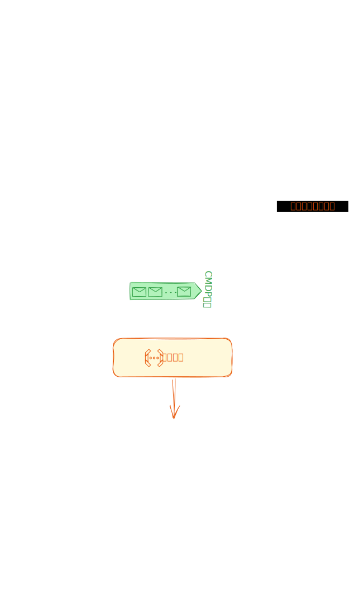

理解命令执行过程对于有效使用`iStock Shell`会很有帮助，特别是在遇到错误需要排查时。

## 执行过程

1. **用户输入命令：** 用户在界面输入框输入命令，即指定他们想要执行的操作。
2. **命令处理与响应：** iStock Shell使用[`@istock/editor`](/packages/editor/README.html)代码库来处理用户输入，并响应用户界面的操作。
3. **命令解析：** [`@istock/command-parser`](/packages/command-parser/README.html)命令解析器解析命令，区分命令、选项和参数，并添加样式以提高可读性。
4. **数据传输与处理：** 用户回车后，解析好的命令数据通过[`cmdp协议`](/std/protocol.html)传输到Web Worker，一个独立的线程用于处理数据。
5. **数据分析：** 在Web Worker中，[`@istock/iswork`](/packages/iswork/README.html)命令服务框架库对接数据源，分析数据并进行必要的计算。
6. **结果返回：** 处理完成后，命令服务框架库将结果返回给用户界面[`@istock/shell-ui`](/packages/shell-ui/README.html)，以便展示给用户。

## 执行流程图

下面的图示展示了整个命令执行过程，有助于更形象地理解内部执行的流程。

