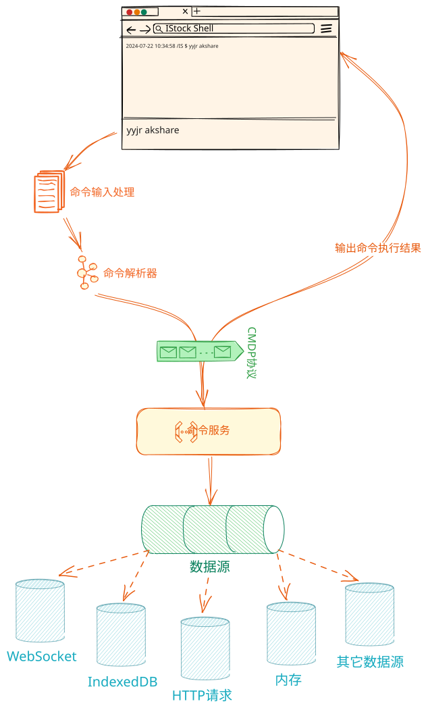

# 命令执行流程

理解命令的执行过程，不仅能满足我们对技术的好奇心，更能帮助我们在使用 **iStock Shell** 时更好地排查问题、理解性能瓶颈以及编写更高效的指令。

## 概览

当你在终端输入一行命令并按下回车键时，这行文字在毫秒级别内经历了一场复杂的“旅行”。它被拆解、传输、分析、执行，最终变成你屏幕上的数据或图表。

整个过程可以大致分为三个阶段：**解析阶段**、**处理阶段**、**渲染阶段**。

## 详细流程

### 1. 解析阶段 (Parsing)

一切始于输入。

- **捕获**：[`@istock-shell/editor`](/packages/editor/README.html) 实时监听你的键盘输入。
- **词法分析**：当你按下回车，命令解析器（Command Parser）接管输入字符串。它将文本打散成一个个“Token”（标记）。
- **语法分析**：Token 被组装成抽象语法树（AST）。系统此刻明白了什么是命令名（`tb`），什么是参数（`gplzt`），什么是选项（`-x`）。
  - _例如：`yyjr akshare | mlcz -mc 应用` 会被识别为两个独立的命令节点，通过管道连接。_

### 2. 传输阶段 (Transmission)

iStock Shell 采用了先进的双线程架构：UI（界面）运行在主线程，而繁重的计算和数据请求运行在 **Web Worker** 线程中，保证界面永远流畅不卡顿。

- **CMDP 协议封装**：解析后的命令数据被封装成 **CMDP (Command Prompt Protocol)** 消息。这是一种专为 iStock Shell 设计的通讯协议，类似 HTTP 但更轻量高效。
- **跨线程通讯**：消息通过 `postMessage` 此时从主线程“飞”往 Web Worker 线程。

### 3. 处理阶段 (Processing)

这是“大脑”工作的核心区域，由 [`@istock-shell/iswork`](/packages/iswork/README.html) 框架接管。

- **路由分发 (Routing)**：系统根据命令名（如 `yyjr`），在注册表中查找对应的 **Controller**（控制器）。
- **业务逻辑 (Service)**：控制器调用 **Service**（服务层）。在这里，系统会执行真正的业务逻辑：
  - 可能是向 AkShare 发起网络请求获取股票数据。
  - 可能是调用 AI 模型进行分析。
  - 可能是查询本地数据库。
- **管道流转 (Piping)**：如果命令包含管道符 `|`，上一个命令的输出结果（Output）将作为输入（Input）传递给下一个命令（如 `tb` 图表命令）。

### 4. 渲染阶段 (Rendering)

当所有处理完成后，结果需要呈现给你。

- **结果封装**：最终数据被封装回 CMDP 响应包。
- **回传 UI**：数据传回主线程。
- **组件匹配**：[`@istock-shell/ui`](/packages/shell-ui/README.html) 根据返回的数据类型（是纯文本、表格数据、还是图表配置？），自动选择最合适的组件进行渲染。
  - **表格数据** -> 渲染为交互式表格。
  - **图表配置** -> 调用 G2/ECharts 渲染图表。
  - **文本/Markdown** -> 渲染为富文本。

## 执行流程图

下面的图示直观地展示了数据如何在各个模块间流转：

## 常见问题排查

了解了流程，当遇到报错时，你就可以精准定位：

- **未找到该命令**：通常是解析阶段出错，需要检查是否有对应应用、是否进入了正确的应用环境、命令拼写是否正确。
- **一直加载中**：通常是处理阶段（Worker）正在请求网络数据，或者数据量过大正在计算，或者报错未被处理中断了。
