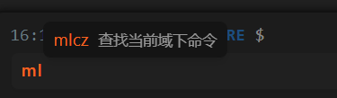
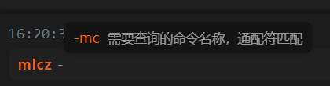
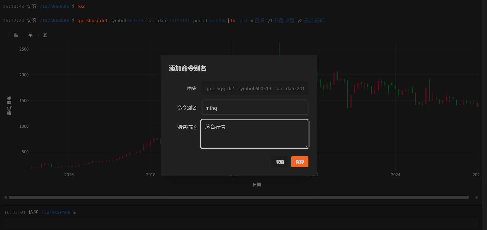
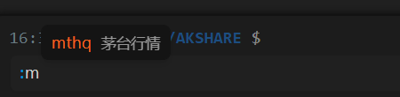

# 快速上手

欢迎使用 `iStock Shell`！这是一个 **AI 原生** 的金融数据分析终端，它将传统的命令行交互与大语言模型（LLM）完美融合。在这里，您不仅可以通过精准的命令查询全市场数据，还能使用自然语言与 AI 对话，获取深度的市场洞察。

访问演示地址 [https://istock.red/shell](https://istock.red/shell)，立即开启您的金融探索之旅。

## ⚠️ 准备工作

### 阅读免责声明

在使用前，请务必仔细阅读系统弹出的`免责声明`。

::: warning 注意
使用本软件意味着您已完全理解并同意免责声明中的所有条款，知晓金融投资存在的风险。
:::

## 💡 核心概念

在开始之前，了解以下两个核心概念将有助于您更流畅地使用：

- **应用 (App/Domain)**：
  `iStock Shell` 将不同的业务划分在不同的"应用"中（如 AKSHARE、投资日历等）。这就好比电脑中的文件夹，您需要进入对应的文件夹才能查看其中的文件。

- **命令 (Command)**：
  - **全局命令**：在任何位置都能使用的通用指令（如查找应用、AI 对话）。
  - **应用命令**：仅在特定应用下生效的专业指令（如 AKSHARE 下的"历史行情查询"）。

## 🚀 基础交互

### 1. 发现应用 (yycz)

不知道支持哪些应用？使用 `yycz` (应用查找) 命令查看所有可用应用。

输入：`yycz`
<IStockShellDemo cmd="yycz" :domains="[]"/>

### 2. 进入应用 (yyjr)

找到感兴趣的市场后，使用 `yyjr` (应用进入) 命令切换环境。例如，我们要分析 AKSHARE数据：

输入：`yyjr akshare`
<IStockShellDemo cmd="yyjr akshare" :domains="[]" height="200"/>

> **提示**：执行后，命令行的提示符路径会变为 `/akshare`，表示您已成功进入该环境。

### 3. 探索功能 (mlcz)

进入应用后，想知道能做什么？使用 `mlcz` (命令查找) 列出当前应用下的所有可用命令。

输入：`mlcz`
<IStockShellDemo cmd="mlcz" :domains="[]"/>

## 🤖 AI 智能辅助

`iStock Shell` 内置了大语言模型能力。当您不仅需要数据，更需要分析和建议时，请呼叫 AI。

### 使用 AI 命令

使用 `ai:` 前缀加上您的问题，直接与 AI 对话。

输入：`ai:简短介绍下当前宏观经济？`
<IStockShellDemo cmd="ai:简短介绍下当前宏观经济？" :domains="[]" height="400"/>

您可以尝试问它："如何分析KDJ指标？" 或 "如何投资A股？"

## 📊 数据查询与可视化

`iStock Shell` 的强大之处在于灵活的数据处理与可视化能力。

### 查询数据

以查询 **贵州茅台** 的历史行情为例（需先进入 `AKSHARE` 应用）：

输入：`gp_lshqsj_dc1 -symbol 600519 -start_date 20250101`
<IStockShellDemo cmd="gp_lshqsj_dc1 -symbol 600519 -start_date 20250101" :domains="[{viewName: 'AKSHARE',name: 'akshare'}]"/>

### 管道操作与绘图

支持类 Unix 的管道操作符 `|`，将数据传递给图表工具。

**示例 1：绘制 K 线图**
将历史行情数据转换为专业的蜡烛图：

输入：`gp_lshqsj_dc1 -symbol 600519 -start_date 20150101 -period monthly | tb gplzt -x 日期 -y1 开盘,收盘 -y2 最高,最低`
<IStockShellDemo height="610" cmd="gp_lshqsj_dc1 -symbol 600519 -start_date 20150101 -period monthly | tb gplzt -x 日期 -y1 开盘,收盘 -y2 最高,最低" :domains="[{viewName: 'AKSHARE',name: 'akshare'}]"/>

**示例 2：绘制成交额统计图**
将数据转换为条形图：

输入：`gp_lshqsj_dc1 -symbol 600519 -start_date 20150101 -period monthly | tb txt -x 日期 -y 成交额`
<IStockShellDemo height="590" cmd="gp_lshqsj_dc1 -symbol 600519 -start_date 20150101 -period monthly | tb txt -x 日期 -y 成交额" :domains="[{viewName: 'AKSHARE',name: 'akshare'}]"/>

## ⚡ 效率倍增技巧

### 1. 智能补全 (Tab)

无需死记硬背命令：

- 输入前缀（如 `ml`）按 `Tab` 键 -> 自动提示可用命令并选择后自动补全命令。

- 输入命令后（如 `mlcz -`）按 `Tab` -> 自动提示可用参数（如 `-mc`）。

### 2. 历史回溯 (Ctrl + ↑/↓)

想修改刚才的命令？

- 使用 `Ctrl + ↑` 快速调出上一条命令。
- 使用 `Ctrl + ↓` 向下翻阅历史记录。

### 3. 命令别名 (Alias)

对于常用的长命令，可以给它起个"昵称"。

**操作步骤**：

1. 在命令输出结果区域，点击鼠标**右键**。
2. 选择 **"添加别名"** (或按 `Ctrl+Alt+A`)。
3. 输入您喜欢的名称（例如：`茅台行情`）。

**使用别名**：
输入 `:` (冒号)，按 `Tab` 键，选择您的别名即可一键执行。

---

现在，您已经掌握了 `iStock Shell` 的基本操作。开始您的探索吧！
